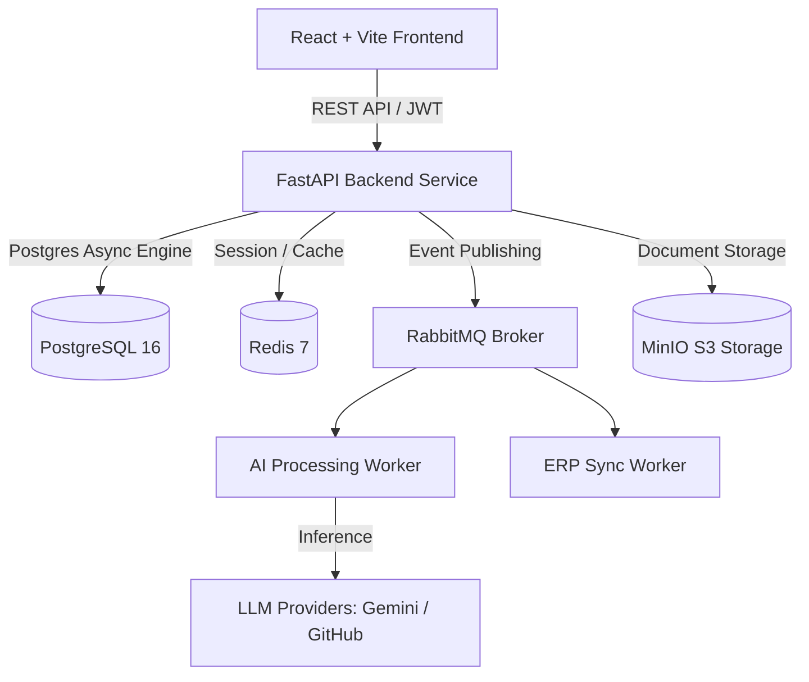

# HIR - Human Intelligent Review (AI Document Intelligence)

[]()
[]()
[]()
[]()
[]()

**HIR (Human Intelligent Review)** is an enterprise-grade AI Document Intelligence and Active Learning platform. It automates document classification, OCR extraction, confidence scoring, and validation while providing a seamless Human-in-the-Loop (HITL) review workspace with real-time feedback loops to optimize AI prompts and extraction accuracy.

---

## 🌟 Key Features

### 📑 Document Processing & AI Extraction
- **Automated Extraction**: Classifies documents, extracts fields, and calculates confidence scores.
- **Queue Controls**: Pause, delete, or manually re-process stuck documents directly from the workspace.
- **Multi-Provider AI**: Supports GitHub Models, Google Gemini API, and customizable LLM providers via an abstracted Provider Manager. Users can force-override the AI provider on a per-document basis.
- **Validation Rules**: Configurable field validators ensuring data compliance before ERP sync.

### 👤 Human-in-the-Loop (HITL) Review Workspace
- **Side-by-Side Review**: Interactive PDF viewer alongside extracted field inputs.
- **Draft & Approval Workflows**: Save progress, override AI predictions, and execute one-click approvals.
- **Audit Trails**: Full history of modifications, reviewer inputs, and approval actions.

### 🧠 Active Learning Engine
- **Correction Collector**: Captures reviewer corrections to continuously train and optimize AI prompts.
- **Prompt Optimizer & Dataset Builder**: Builds fine-tuning datasets and auto-optimizes prompt templates based on reviewer corrections.
- **Reviewer Analytics & Quality Reports**: Tracks extraction accuracy, reviewer speed, throughput, and error patterns.

### 📊 Analytics & Administration
- **Operations BI Dashboard**: Real-time metrics for document velocity, throughput, error rates, and cost tracking.
- **Multi-Tenant Administration**: Role-Based Access Control (RBAC), tenant isolation, user management, and system configuration.
- **Export Engine**: Export analytics and dataset records in JSON, CSV, or JSONL formats.

### 🩺 Monitoring & Telemetry
- **Prometheus Metrics**: Exposes custom metrics for document lifecycle events and system health.
- **OpenTelemetry Instrumentation**: Distributed tracing across FastAPI backend, Redis, and RabbitMQ.
- **Health Endpoints**: Live readiness/liveness checks for Database, Cache, Storage, and Queue brokers.

---

## 🛠️ Architecture & Tech Stack



| Component | Technology / Stack |
| :--- | :--- |
| **Backend API** | Python 3.12, FastAPI, Pydantic V2, AsyncIO, SQLAlchemy 2.0 |
| **Frontend UI** | React 18, TypeScript, Vite, TailwindCSS, Zustand, React Query |
| **AI Engine** | Python AI Pipelines, Custom Validators, Prompt Registry |
| **Storage & Messaging** | PostgreSQL 16, MinIO S3, Redis 7, RabbitMQ 3 |
| **Testing & Quality** | Pytest, AsyncMock, ESLint, TypeScript Compiler |

---

## 📁 Repository Structure

```
HIR-ai-document-intelligence/
├── ai/                      # AI Worker, Classifiers, Validators & Pipelines
├── backend/                 # FastAPI Backend Application (Domain-Driven Architecture)
│   ├── app/
│   │   ├── api/             # API Routers (Auth, Documents, Learning, Admin, Analytics, Monitoring)
│   │   ├── application/     # Application Services, Commands & Business Logic
│   │   ├── core/            # Configuration & Security Settings
│   │   ├── domain/          # Core Domain Models & Interfaces
│   │   ├── infrastructure/  # DB Repositories, MinIO, Event Publisher & Telemetry
│   │   └── schemas/         # Pydantic Schemas & DTOs
│   └── tests/               # Pytest Unit & Integration Tests
├── erp_worker/              # ERP Integration & Synchronization Worker
├── frontend/                # React + TypeScript Frontend Web Application
│   └── src/
│       ├── api/             # API Client Modules (Admin, Analytics, Learning)
│       └── features/        # React Components (Admin, Analytics, Learning, Reviews, Monitoring)
├── docker-compose.dev.yml   # Docker Infrastructure setup for local development
└── .env                     # Local Environment Configuration
```

---

## 🚀 Getting Started

### Prerequisites
- **Python**: 3.12+
- **Node.js**: 18+ & `npm`
- **Docker**: Desktop / Engine with Docker Compose

---

### 1. Infrastructure Setup
Spin up PostgreSQL, Redis, RabbitMQ, and MinIO using Docker Compose:

```bash
docker-compose -f docker-compose.dev.yml up -d
```

---

### 2. Environment Configuration
Copy `.env.example` to `.env` and fill in your settings:

```bash
cp .env.example .env
```

Ensure `.env` contains valid credentials:
```ini
APP_NAME="HIR - Human Intelligent Review"
APP_ENV=development

POSTGRES_HOST=localhost
POSTGRES_PORT=5432
POSTGRES_USER=postgres
POSTGRES_PASSWORD=postgrespassword
POSTGRES_DB=hir_db

REDIS_HOST=localhost
REDIS_PORT=6379

RABBITMQ_HOST=localhost
RABBITMQ_PORT=5672

MINIO_ENDPOINT=localhost:9000
MINIO_ROOT_USER=miniouser
MINIO_ROOT_PASSWORD=miniopassword
MINIO_BUCKET_NAME=documents

GEMINI_API_KEY=your-gemini-api-key-here
GITHUB_TOKEN=your-github-token-here
```

---

### 3. Backend Setup

1. Create and activate a Python virtual environment:
   ```bash
   cd backend
   python -m venv .venv
   
   # Windows PowerShell:
   .\.venv\Scripts\Activate.ps1
   # Linux / macOS:
   source .venv/bin/activate
   ```

2. Install dependencies:
   ```bash
   pip install -r requirements.txt
   ```

3. Run the development server:
   ```bash
   uvicorn app.main:app --reload --port 8002
   ```
   *Swagger API Documentation will be available at `http://localhost:8002/docs`.*

### 4. AI Worker Setup

The AI Worker handles asynchronous document classification, OCR, and extraction from the RabbitMQ queues. It must be run in a separate terminal.

1. Ensure the backend virtual environment is activated.
2. Run the AI Worker from the **root directory** (not the backend folder):
   ```bash
   # Windows PowerShell:
   $env:PYTHONPATH="."; .\backend\.venv\Scripts\python.exe -m ai.worker.main
   
   # Linux / macOS:
   export PYTHONPATH="."
   ./backend/.venv/bin/python -m ai.worker.main
   ```

---

### 5. Frontend Setup

1. Navigate to the frontend directory:
   ```bash
   cd frontend
   ```

2. Install npm packages:
   ```bash
   npm install
   ```

3. Start the Vite dev server:
   ```bash
   npm run dev
   ```
   *Frontend interface will be available at `http://localhost:5173`.*

---

## 🧪 Running Tests

### Backend Unit & Integration Tests
Run pytest within the backend directory:

```bash
cd backend
.\.venv\Scripts\python.exe -m pytest
```

---

## 📜 License

Distributed under the MIT License. See `LICENSE` for more information.
